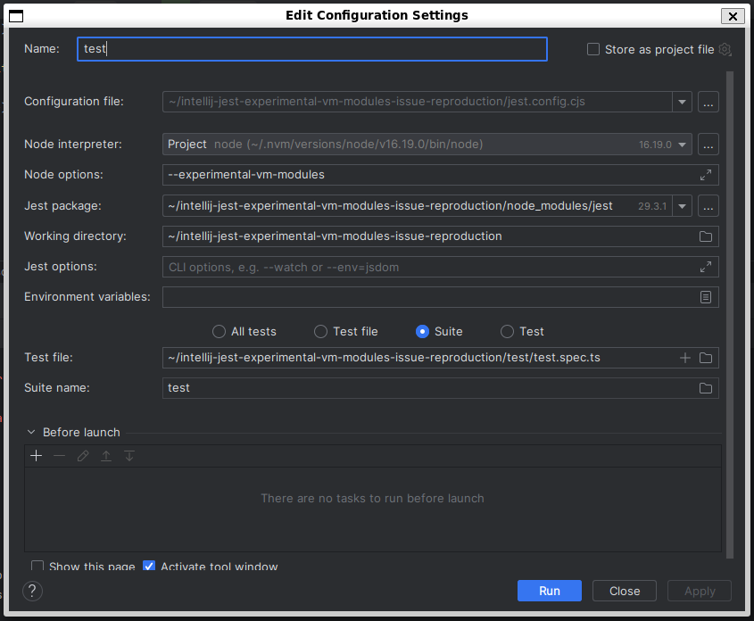
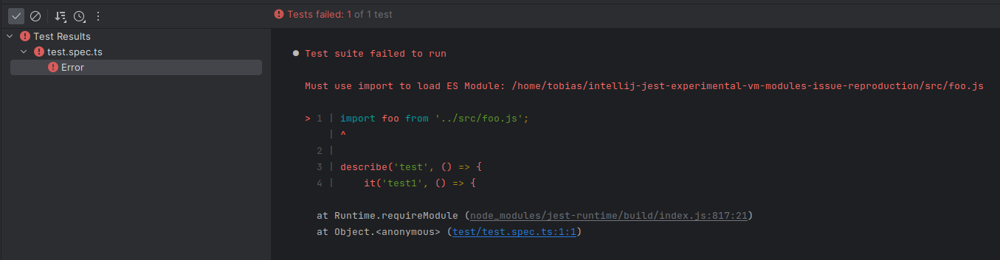

# IntelliJ Jest experimental-vm-modules Issue Reproduction

This minimal project reproduces [an issue](https://youtrack.jetbrains.com/issue/WEB-52967/Automatically-add-experimental-vm-modules-to-Jest-for-ESM-projects) with IntelliJ IDEA 2022.3.1, Jest and the automatic addition of the `--experimental-vm-modules` flag.

## The Issue
Running `test/test.spec.ts` from within IntelliJ causes IntelliJ to add `--experimental-vm-modules` to the run configuration automatically:

This results in the following error:

Removing the `--experimental-vm-modules` flag from the run configuration fixes the issue.

